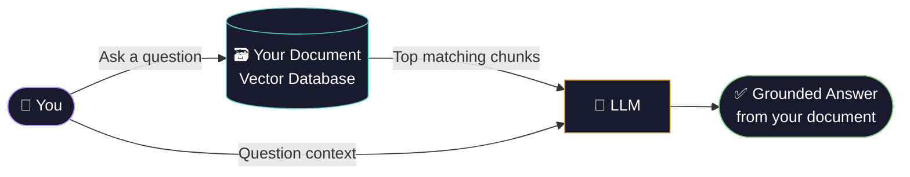
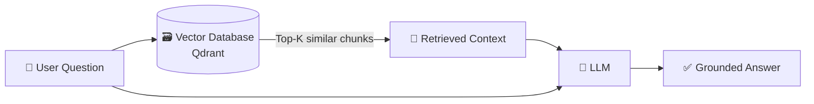
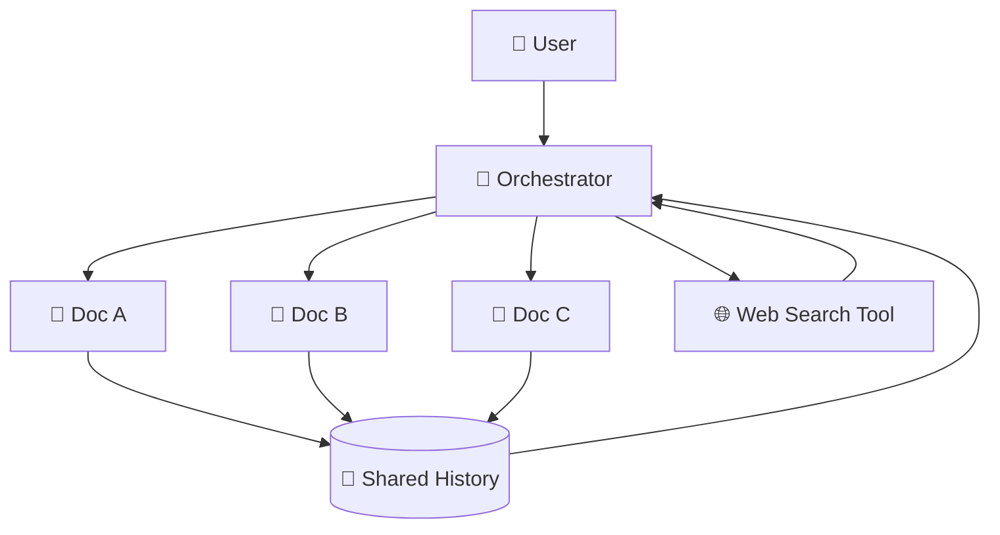
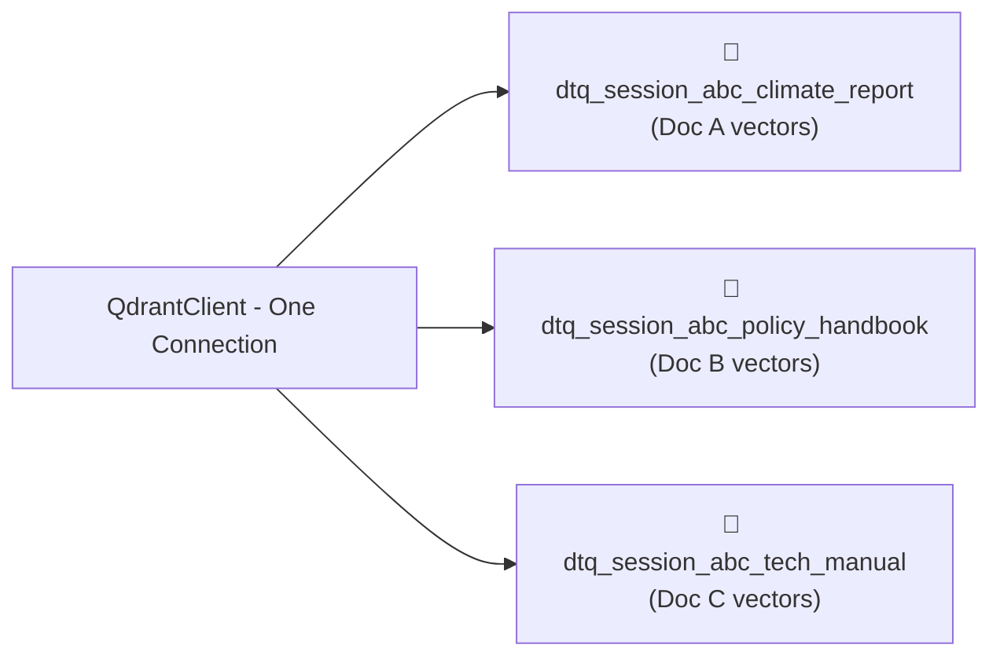
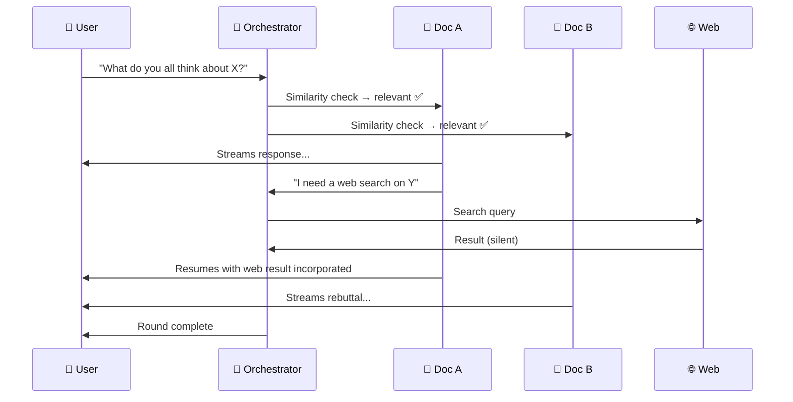

# DoqToq Groups — Hackathon PPT Full Script & Outline

*11 slides · Dark theme · DoqToq brand colors: orange #e8a04a, cyan #5bcfc5, lavender #b48eff*

---

## Slide 1 — Title Slide
**Title:** DoqToq Groups  
**Subtitle:** When Your Documents Stop Listening — and Start Talking to Each Other  
**Image:** `assets/doqtoq_cover_photo.png` full-bleed background  
**Bottom:** Team name · Hackathon · March 2026

---

## Slide 2 — The Problem with AI Today

> **PPT Template Match:** Use this content to fill in your light-themed 2-column image layout exactly as shown in your screenshot.

**Slide Title (Top Center):** THE PROBLEM WITH AI TODAY

---

### Left Column (Image 1)
**Image to use:** `dev_assets/slide2_hallucination.png`

**Bold Text:** It Makes Things Up (Hallucination)

**Subtext Line 1:** AI invents facts and citations with complete confidence.
**Subtext Line 2:** Because it can't access your private documents, every answer might sound plausible—but be completely wrong.

---

### Right Column (Image 2)
**Image to use:** `dev_assets/slide2_sycophancy.png`

**Bold Text:** It Acts Like a Mirror (Sycophancy)

**Subtext Line 1:** Standard AI has no conviction; it just agrees with whatever option you suggest is correct.
**Subtext Line 2:** An AI that mirrors your every opinion is as useless as one that knows nothing at all.

---

**Speaker Note for this slide:**
*"These two problems mean you can get any answer you want from AI right now—which means you can't trust any answer you get. Confidence and correctness are not the same thing."*

---

## Slide 3 — Introducing DoqToq: RAG Done Right

> **PPT best practice:** Slide 3 has two jobs — (1) explain RAG in 30 seconds, (2) show what makes DoqToq different. Split the visual and the concept clearly.

**Headline:** *What if the AI could only answer from your document?*

---

### Top Half — What is RAG?

**One-line explanation on slide:**
> RAG = Retrieval-Augmented Generation. Instead of relying on training data, the AI searches your document first — then answers.

**Mermaid diagram for the slide:**

**Key point (one line on slide):** The document is the source of truth — not the AI's memory, not your prompting.

---

### Bottom Half — What Makes DoqToq Different?

**Two chat bubbles side by side:**

| 🔵 Traditional RAG — 3rd Person | 🟠 DoqToq — 1st Person |
|---|---|
| *"According to the document, Chapter 3 discusses renewable energy adoption..."* | *"In my third chapter, I explored renewable energy — and what I found about grid integration is directly relevant to your question..."* |
| Feels like a search engine. Cold. Distant. | Feels like an expert. Alive. Engaged. |
| The AI talks **about** the document | The document **is** the speaker |

**Closing line on slide (large, bold):**
> *DoqToq turns your PDF into a conversation partner — not a search result.*

**Speaker note:** *"The 1st-person shift changes everything about how you engage with information. You stop querying a database and start having a conversation with an expert who wrote the book — literally."

---

## Slide 4 — DoqToq Groups: The Next Evolution
**Headline:** What If Your Documents Could Talk to *Each Other*?

**Body:**
- Single document chat is powerful. But real decisions require multiple sources.
- DoqToq Groups creates a **Discussion Room** — a shared space where multiple documents collaborate in real time
- Each document gets an AI-generated **persona** (e.g., *"The Climate Report"*, *"The Policy Handbook"*)
- Users can `@mention` specific documents. Documents can `@mention` each other.
- The discussion feels like a **group chat** — not a database query

**Image:** `assets/DoqToq-Groups-conversation.png`

**Speaker note:** *"Think WhatsApp group chat — but your documents are the participants."*

---

## Slide 5 — The Brain: The Orchestrator
**Headline:** 4 Roles. One Smart Conversation.

**Body — 4 role cards (horizontal):**

| 👤 User | 📄 Documents | 🧠 Orchestrator | 🌐 Web Tool |
|--------|-------------|-----------------|------------|
| Asks questions, steers discussion, @mentions | Each has its own knowledge base (Qdrant collection) and persona | Decides who speaks, prevents loops, detects knowledge gaps | Summoned by the Orchestrator when docs hit a wall |

**How a turn works:**
1. User asks → Orchestrator checks which docs are relevant (vector similarity)
2. Relevant docs queue up and respond one-by-one (streamed live to user)
3. Each response is shared with all other docs — they can agree, add, or push back
4. Orchestrator detects when docs are repeating themselves → ends the round

**Image idea:** Turn-taking flow diagram (see Image Ideas section)

---

## Slide 6 — Under the Hood: Tech That Makes It Scale
**Headline:** Smart Choices for a Production-Ready System

**Three columns:**

**Vector Gating**  
No extra LLM calls for routing. We use similarity search to decide who speaks — fast, cheap, accurate. Only relevant documents generate a response.

**Milestone Context Compaction**  
As conversations grow, we compress old messages at checkpoints (not every turn). The LLM always gets fresh recent context without hitting token limits.

**PostgreSQL + Qdrant**  
Qdrant stores document vectors. PostgreSQL stores the rest — room metadata, persona names (generated once, reused forever), full chat history, and a silent web search audit log.

**Footer tech strip:**  
`LangChain` · `Qdrant` · `PostgreSQL` · `Streamlit` · `Gemini / Mistral / Ollama` · `Python 3.12`

---

## Slides 7–9 — Use Case Scripts

### Slide 7 — Use Case 1: The PhD Student
**Headline:** 📚 4 Research Papers. One Question. One Conversation.

**Script (read aloud / animate slide as you speak):**

> Meet Priya. It's 2am, and her thesis defense is in 8 hours. She has four research papers open in different tabs — all on quantum error correction — but they contradict each other in ways she can't reconcile alone.
>
> She opens DoqToq Groups and uploads all four papers. The system gives each one a name.
>
> She types: *"Where do these papers agree and disagree on error correction thresholds?"*
>
> Paper A speaks first — citing its own experimental data on surface code error rates.  
> Paper B adds a theoretical framework that Paper A didn't address.  
> Paper C challenges Paper B directly — *"@Paper B, your threshold model doesn't account for decoherence under lab conditions, which my Section 3 specifically covers."*  
> Paper D brings in how these errors affect quantum cryptography protocols.  
>
> In under two minutes, Priya has a four-way synthesis that would have cost her three hours of cross-referencing.

**Image:** `dev_assets/usecase1_student.png`

---

### Slide 8 — Use Case 2: The Board Meeting
**Headline:** 🏢 The Boardroom That Never Sleeps

**Script:**

> Vikram is a legal director. The board needs an answer before tomorrow: *"Can we extend our employee referral bonus to contractors?"*
>
> He opens a Discussion Room with four company documents — the User Policy, the Legal Compliance Guide, the Company Policy, and the Product Details Doc. One question triggers a boardroom.
>
> The User Policy Doc speaks: referral bonuses currently only apply to full-time staff.  
> The Legal Compliance Doc immediately flags a risk — contractor bonus structures could trigger worker misclassification under labour law.  
> The Company Policy Doc responds: *"@Legal Compliance, this aligns with our HR-22 policy — a board resolution would be needed before any change."*  
> The Product Doc adds an angle nobody expected — this change could skew contractor-to-fulltime conversion metrics tracked in the hiring pipeline.
>
> What would have been a four-department email thread — spanning days — resolved in a single conversation.

**Image:** `dev_assets/usecase2_board.png`

---

### Slide 9 — Use Case 3: The Missing Clause
**Headline:** ⚖️ The Clause They Almost Missed

**Script:**

> Neha is a junior associate at a CA firm. A new client — Acme Corp — wants to know if their contract permits subcontracting to an overseas freelancer.
>
> She opens a Discussion Room with four documents: the Acme client contract, the labour law handbook, their internal compliance guide, and the tax regulation manual.
>
> She asks: *"Can we subcontract to an overseas individual under this contract, and are there any legal obligations?"*
>
> The Acme Contract confirms subcontracting is permitted — with prior written consent.  
> The Labour Law Handbook notes the freelancer may qualify as a "dependent contractor" under Section 14, triggering additional obligations.  
> The Compliance Guide says their internal HR-31 policy requires NDA signing and a background check.  
> And then — the Tax Regulation Guide quietly adds what everyone else missed: *"If the subcontractor is overseas, withholding tax under Section 195 of the Income Tax Act applies."*
>
> That one line — silently flagged by a document — saved the firm from a compliance penalty.

**Image:** `dev_assets/usecase3_legal.png`

---

## Slide 10 — Future Enhancements
**Headline:** What's Next

**Bullets (keep concise):**
- 🔍 **GraphRAG** — documents become aware of their own internal relationships and structure
- 👥 **Multi-user rooms** — multiple humans + multiple documents in one live session
- 🌐 **Seamless Web-to-Room Import** — Users can search for, download, and seamlessly inject relevant papers from the web directly into the active discussion room
- ⚡ **Cost & Context Optimization** — Advanced tuning of the Orchestrator to minimize LLM token usage and intelligently manage long context windows
- 📊 **Usage analytics** — which documents get consulted most, what topics emerge
- 🔐 **Auth + room sharing** — share Discussion Rooms with your team

---

## Slide 11 — Conclusion
**Headline:** Documents Don't Just Talk. They Think Together.

- DoqToq Groups turns isolated documents into collaborative, first-person knowledge agents
- A smart Orchestrator enables real discussion — not just parallel lookups
- Built on production-grade infrastructure: LangChain, Qdrant, PostgreSQL, Streamlit

**Closing line (large, centered, bold):**
> *"Stop reading documents. Start having conversations with them."*

**Image:** `assets/DoqToq-social-preview.png`

---

## Image Ideas for the PPT

### Image 1 — The RAG Pipeline (Slide 2)
**What it is:** A clean flowchart showing how a user question flows through vector search into the LLM.  
**How to make it:** Mermaid diagram

---

### Image 2 — 1st Person vs 3rd Person Chat Bubbles (Slide 3)
**What it is:** Two chat bubbles side by side. Left = cold 3rd-person AI response. Right = warm 1st-person DoqToq response.  
**How to make it:** Generate with the image tool or make it in Canva/PowerPoint as two styled text boxes  
**Style:** Dark background, left bubble in blue/grey, right bubble in orange

---

### Image 3 — Information Silos Problem (Slide 2 or intro)
**What it is:** 5 document icons in separate boxes, arrows pointing at a confused human in the center.  
**How to make it:** Excalidraw or drawn in PowerPoint with shapes  
**Message:** "You are the bottleneck. You have to connect the dots manually."

---

### Image 4 — 4 Roles Architecture (Slide 5)
**What it is:** A visual version of the 4-role flow: User → Orchestrator → Documents → Web Tool.  
**How to make it:** Mermaid diagram

---

### Image 5 — Qdrant Collection Isolation (Slide 6)
**What it is:** One Qdrant server with 3 separate collection "folders" inside it, each named for a document.  
**How to make it:** Mermaid diagram

---

### Image 6 — Turn-Taking Flow (Slide 5)
**What it is:** A sequential flowchart showing how one user turn becomes a multi-doc discussion round.  
**How to make it:** Mermaid sequence diagram

---

### Image 7 — Existing: DoqToq Groups Conversation (Slide 4)
**What it is:** Already exists — `assets/DoqToq-Groups-conversation.png`  
**Use as-is** on Slide 4.
